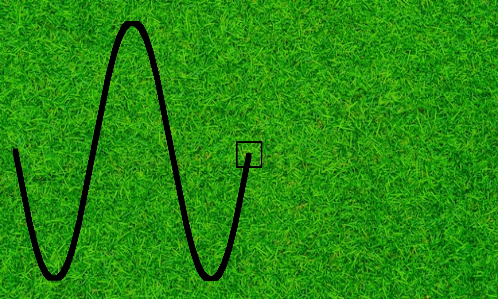
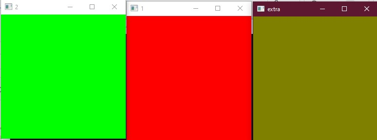

# Lab_1
## Задание
Необходимо создать программу, которая выводила бы анимацию движения робота телеги (нарисовать вид сверху схематично) по синусоиде или косинусоиде (зависит от чётности варианта). Траекторию также необходимо нарисовать. Фон для данной анимации необходимо загрузить из какого-либо файла(любой). Когда робот будет на середине экрана, то необходимо сохранить изображение в файл встроенными средствами OpenCV.
## Выполнение 

не то чтобы красиво, но вроде едет, сохраняется когда достигает центра горизонтальной оси ( преодалевает половину расстояния по оси Х). Окно закрывается когда телега достигает конца окна. С косинусом и синусом честно не уверен что-то (постоянно номер меняется), но сделал по синусу.

## Доп. Задание
Написать свою программу, которая берет на вход два изображения и смешивает их с задаваемым коэффициентом. Под смешиванием понимается blending, заключающийся в сложении интенсивностей пикселей двух изображений по правилу.

## Выполнение 
Выбрал данное доп задание, результат на рисунке.

При проходе изображения использую итераторы.
 

