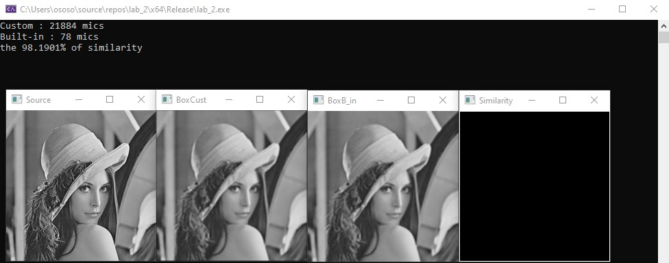
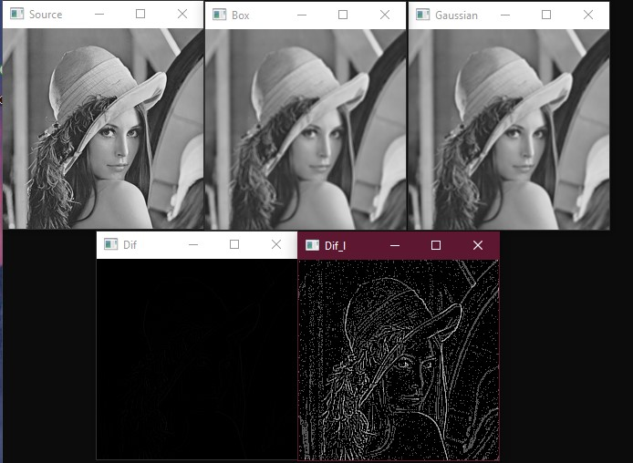

# Lab_2
## Задание
1.	Создать отдельную функцию, которая бы сглаживала одноканальное изображение при помощи фильтра по среднему значению пикселей внутри ядра размером 3х3 (в лекциях обозначен как box filter). Для этого рекомендуется использовать ОИ. Функция вычисления, однако, должна иметь возможность менять размер окна
2.  Проверить правильную работу созданной функции при помощи функции из OpenCV void blur(InputArray src, OutputArray dst, Size ksize). Для этого необходимо программно сравнить изображения, проверяя равенство каждого пикселя одного изображения другому пикселю. Для этого рекомендуется использовать способ The Core Function из ранее приведённой ссылки.  Вывести значение их схожести в виде процентов. Если схожесть 98%-100%, то твоя функция работает исправно. Отличие в немного % может объясняться тем, что вы не обработали рамку по краям изображения. Иногда эту рамку оставляют (как в нашем простом случае), иногда обрабатывают, достраивая дополнительные пиксели или беря их с других участков изображения. Необходимо вывести оба изображения.  
3.	Измерить время работы каждой функции и вывести его в консоль. Вывести результат измерений.
4.	Отфильтровать изображение функцией Гаусса и сравнить результат с box filter. Субъективно оценить качество изображения. Вывести оба изображения и сравнить их путем наложения и вывода разности двух фильтраций. Улучшить отображение выведенной разницы применив логарифмическое преобразование изображений.
5.	Реализовать unsharp mask с фильтром Гаусса и Box фильтром. Оба фильтра необходимо применить с одинаковым коэффициентом резкости (см. выше). Сравнить оба изображения путем наложения и вывода разностного изображения.
6.	Реализовать фильтр Лапласа (руками, свой). Вывести результат. 
7.	Реализовать unsharp mask с фильтром Лапласа. Вывести результат и сравнить с п.5.
## Выполение 
1. На риснуке изображены: исходное изображение "Source", кастомный box filter "BoxCust", встроенный box filter "BoxB_in", а также изображение отражающее попиксельное сравнение "Similarity", есть рамка возникла из-за паддинга нулями в кастомном фильтре.

Результаты измерения быстродействия показывают, что кастомный алгоритм фильтрации в 200 раз медленее встроенного, значение процента схожести попадает в допустимые интервалы 98-100 % 
2. На данном рисунке изображены: исходное изображение "Source", встроенный box filter "Box", встроенный filter Гаусса "Gaussian", разница между двумя результатами фильтрации "Dif", а так же обработанная логарифмическим преобразованием для более явного восприятия различий (был написан вручную так-как не подключается нужная библитоека для использования встроенного).

Разница между двумя результатами фильтрации, сложно уловимая, но можно заметить, она выражается в большей плавности после фильтрации гаусса, а также в угловатостях на фильтрации box фильтром, это связанно с различной формой ядер.
