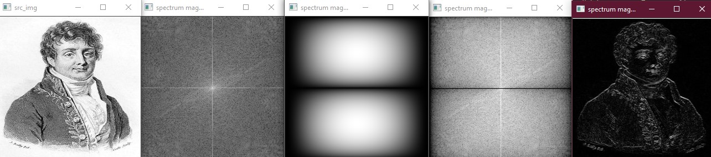

# Lab_4
## Задание 1
*	Написать свою функцию преобразования Фурье (прямое и обратное) используя «лобовой подход».

Была написана одна функция, основанная на матричном способе. По сути для того, чтобы сделать преобразование обратным необходимо изменить степень е положительной. Вроде как работает. 

Также встроенный метод

## Задание 2
* Написать преобразование Фурье используя алгоритм Radix-2 (по основанию 2, или «Бабочка») .

Ну вроде как написал fft, важно заметить что размеры входного изображения степени 2 (изначально смутился немного), вроде все даже и работает, но... 

в следующем пункте
ниже пример работы

## Задание 3
* Сравнить быстродействие из функций из первой и второй части, а также с преобразованием из OpenCV

В целом лидер был ожидаем изначально, однако удивил написаный мною dft, если сравнивать с radix-2, однако последний, должен работать быстрее, второго, цифры показывают результат сравнимо, но хуже, возможно дело в неправильном работе с данными( копировании, возможно наличие перегруженных мат операций)

## Задание 7
* Произвести по отдельности свёртку какого-либо изображения  с ядром фильтров: Собеля (по горизонтали и вертикали), усредняющего (BoxFilter), Лапласа 
Выполнено функцией convilution. Ниже представлены примеры работы с разными фильтрами

BOX

SOB_V

SOB_H

LAPL

## Задание 8
* Взять какое-нибудь изображение и в его спектре обрезать в одном случае элементы спектра с высокими частотами, в другом – низкими. А потом выполнить обратное преобразование на основе полученных спектров:
Решение в функции filtration, которая в зависимости от флага обрезает верхнюю или нижнюю части спектра, аатемделает обратное преобразование.в целом оформлено так как было написано в задании. Надеюсь не перепутал кто какой pass)))

Upper_pass

Lower_pass

## Задание 9
* Провести корреляцию (сравнение) изображений автомобильных номеров по очереди с 3-мя символами. Полученный образ Фурье обратно преобразовать в обычное изображение. Найти на нём наибольшее значение, которое принимают элементы. Отнять от этого значения небольшое число (около 0.01). Использовать полученное число в качестве порога для пороговой фильтрации от полученного изображения.

Ну вроде как тоже работает - сorrelation, сначала были проблемы, решил добавить вычитание среднего значения из исходного изображения и шаблона,а только после производить кареляцию, вроде как стало работать намноооого лучше, при этом иногда нужно играть с попроговыми значениями treshold'a, ну чтобы прям точно найти все-все.

