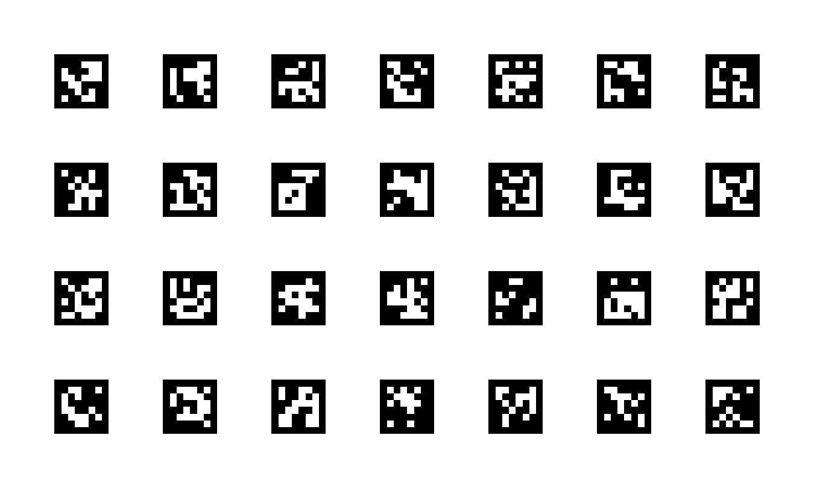
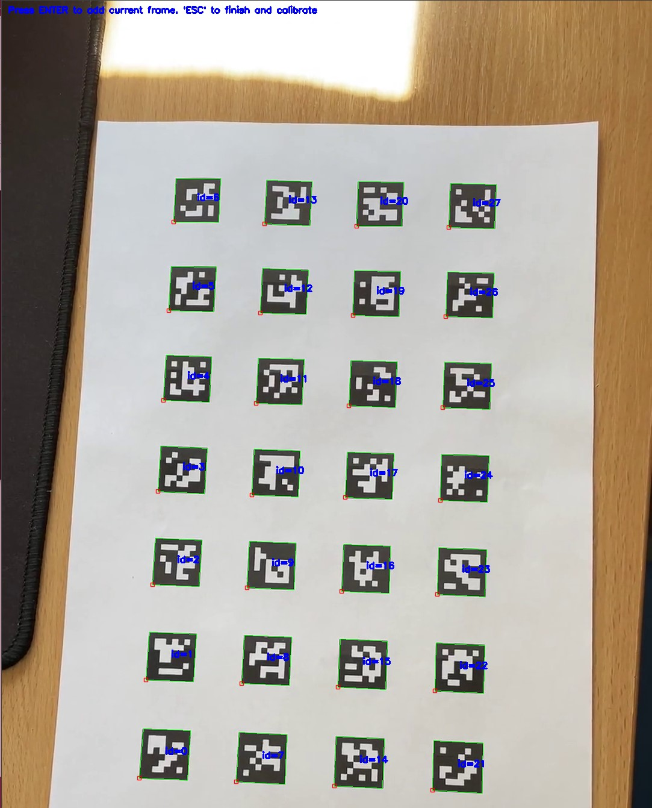
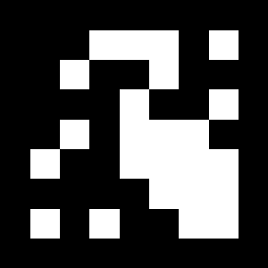

# Lab_5
## Задание_1
* Откалибровать собственную камеру при помощи доски aruco.
* Калибровка камеры была проведена с помощью функции calibrateCamera, предварительно была сгенерирована доска аруко маркеров (board.png) функция create_board.
Работал на компьтере, веб камеры нет, использовал видео, в целом потом нашел программу, которая позволяет принимать изрбражение с телефона.
За основу был взят код из интернета. В результате получен файл с параметрами камеры - calibration.xml. Файл params.yml, соджержащий настройки алгоритма детекции и распознования маркеров был немного изменен, иначе не работало.
Ниже преведена сгенерированная доска также, приведены изображения взятые за основу при калибровке.

## Задание_2 

* Откалибровать с помощью Calibration Toolbox (Matlab)
* У меня его вроде как нет, уточнил сказали что если нет, то в целом можно не делать 

## Задание_3

* Сгенерировать маркер Aruco из понравившегося словаря
* Маркер генерируется функцией create_marker,  и приведен ниже

## Задание_4

* Написать программу, которая бы детектировала маркер на изображении и рисовать куб с основанием в виде маркера (куб должен быть спроецирован на плоскость изображения и иметь различные цвета ребер). Используйте захват видеопотока с камеры (VideoCapture), чтобы получать изображения.
* функция рисующая кубы - create_cubes ,которая используется функцией detection. Пайплайн следующий:
1. Загружаются параметры камеры и параметры детекции
2. Детектируются маркеры, а соответственно и координаты их угов
3. Далее функцией estimatePoseSingleMarkers происходит нахождение матриц преобразований из системы координат маркера к системе координат камеры
4. Тем временем в системе координат маркера задаются вершины куба, которые затем с помощью функции projectPoints проецируются в систему координат камеры, соединяютс линиями - грани куба готовы!

